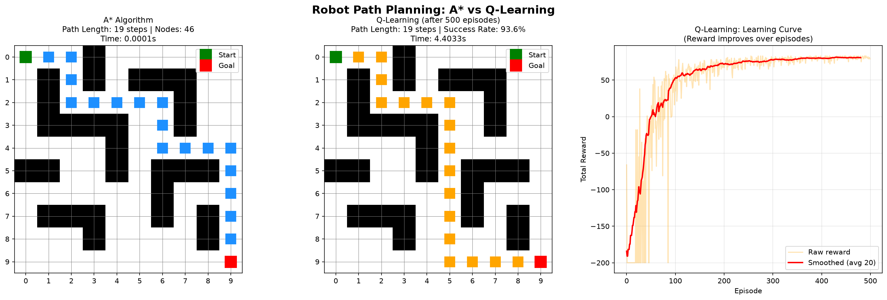

# Robot Path Planning: A* vs Q-Learning

A Python simulation comparing two AI techniques for robot navigation in a grid environment with obstacles.

## Results



## Performance

| Method | Path Length | Success Rate | Time |
|--------|-------------|--------------|------|
| A* (Optimal) | 19 steps | 100% | 0.0001s |
| Q-Learning | 19 steps | 93.6% | 4.4s |

Q-Learning achieved **100% path efficiency** matching the optimal A* solution after 500 training episodes.

## Project Overview

This project implements and compares two fundamental AI path planning algorithms:

- **A* Algorithm** — Classic informed search using heuristics (Manhattan distance). Guarantees the shortest path. Used in GPS, robotics, and game AI.
- **Q-Learning** — Reinforcement learning agent that learns through trial and error over 500 episodes, receiving rewards for reaching the goal and penalties for hitting walls.

## Key Features

- 10x10 grid world with walls and obstacles
- Side-by-side visual comparison of both paths
- Learning curve graph showing AI improvement over 500 episodes
- Performance benchmarking table
- Accuracy metrics: success rate, path efficiency, execution time

## Technologies Used

- Python 3.14
- NumPy
- Matplotlib
- heapq (A* priority queue)

## How to Run

```bash
pip install numpy matplotlib
python main.py
```

## Output

The program prints a performance comparison table and generates a visualization saved as `results.png`.

## Applications

- Autonomous vehicle navigation
- Robot motion planning
- Game AI pathfinding
- Warehouse automation systems

## Author

Dorathisha P — CSE Graduate | AI & ML Enthusiast | Erasmus Mundus Applicant 2027
